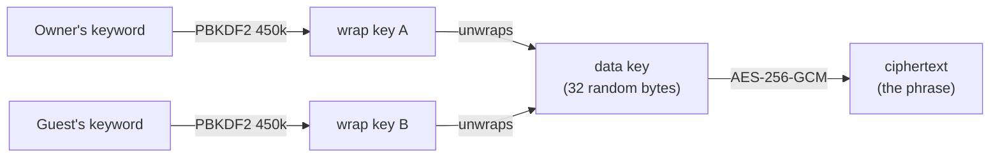

# Coldvault

A self-hosted, encrypted vault for recovery phrases — the 12-to-33 word backups your
wallet gave you, plus the optional PIN and passphrase that go with them.

Each vault is encrypted under a **keyword that is never stored anywhere**. The database
holds ciphertext and nothing else: a full dump reveals no phrase and no keyword. Accounts
are gated by a TOTP authenticator, and a vault can be **shared** with other accounts —
several keywords opening one ciphertext, each revocable — without ever handing over a key
in plain text.

Plain PHP. No framework, no build step, no package manager, no third-party service —
six PHP files, a stylesheet and two scripts.

```
PHP 8.1+   ·   Apache 2.4   ·   MySQL 8 / MariaDB 10.4+   ·   MIT
```

---

## Disclaimer

> **This software is provided as-is, without warranty of any kind, and has not been
> independently audited.** Review it yourself, or have it reviewed, before trusting it with
> anything of value.
>
> Coldvault handles material that grants irreversible control over cryptocurrency holdings.
> A lost keyword, a lost `APP_KEY`, a compromised host, an operator error, or a defect in
> this code can result in the **permanent and unrecoverable loss of funds**. There is no
> reset, no recovery process, no support channel, and no party — including the authors —
> able to restore access on your behalf.
>
> You are solely responsible for auditing the source, for the security of the infrastructure
> you deploy it on, for the strength and custody of the keywords and keys you choose, and
> for maintaining independent backups of anything you store here.
>
> **Use it at your own risk.** If you are not in a position to evaluate the code and the
> deployment yourself, do not use it to store a recovery phrase protecting assets you cannot
> afford to lose. Treat it as a supplementary copy, never as your only one.
>
> Nothing in this repository constitutes financial, legal, or security advice. See
> [LICENSE](LICENSE) for the full terms, and [SECURITY.md](SECURITY.md) for the threat model
> and known residual risks.

---

## Read this before you use it

**This stores your recovery phrase on a server.** That is a real trade, and the honest
version of it is:

- **The server decrypts.** Your keyword travels to PHP, which derives the key and
  decrypts the phrase. Anyone who can edit the code, read process memory, or tamper with
  the running host can capture your keyword and your phrase. Encryption at rest protects
  you against a **stolen database or a stolen backup** — not against a compromised
  server.
- **So: run it yourself, on a host you control.** Every design decision here assumes the
  operator and the owner are the same person. Trusting somebody else's instance means
  trusting them with your coins.
- **It is not a replacement for metal or paper.** It is a second copy that survives a
  house fire. Nothing more.
- **It has had no third-party audit.** The code is small and readable on purpose. Read
  it before you trust it — the whole application is six PHP files.

If you want a design where the server genuinely cannot read your phrase, you want
client-side decryption or an air-gapped machine — not this, and not any other web app
that decrypts server-side while claiming otherwise.

See [SECURITY.md](SECURITY.md) for the full threat model and the known residual risks.

---

## What it does

**Vaults**
- Stores a 12, 15, 18, 20, 21, 24 or 33-word phrase — BIP39 lengths and the 20/33-word
  Shamir-style shares from SLIP-39 — plus an optional PIN and passphrase.
- Paste a phrase into the first slot and the grid detects its length and resizes.
- AES-256-GCM, key derived with PBKDF2-HMAC-SHA256 at 450,000 iterations.
- The phrase is delivered to the browser over an authenticated fetch and written into the
  page by script. It is never present in the HTML document, so it cannot end up in a
  history entry, a resubmitted POST, or a crash-restore.
- Auto-locks after 60 seconds. The grid is wiped, not merely hidden.

**Keywords**
- A keyword must clear an **entropy floor** (65 bits by default) to create a vault, change
  a keyword, or join a shared one. A shared vault is only as strong as its weakest
  keyword, so a guest cannot undermine the owner with a soft one.
- The estimator counts **distinct** word tokens and caps the character-set branch at
  twice the distinct character count, so repetition cannot inflate a score —
  `aaa-aaa-aaa-aaa-aaa-aaa` measures 11 bits, not 66.
- Checked in the browser first, so a rejection never costs you the words you just typed.
- A **Generate** button offers a random 7-word passphrase from the BIP39 list.
- `tools/kwcheck.php` audits a keyword offline, on a machine that never touches this app.

**Accounts**
- Self-registration, then a TOTP authenticator (RFC 6238) — no passwords at all.
- Authenticator secrets are encrypted at rest under `APP_KEY`, so a database dump cannot
  generate valid codes.
- Eight single-use backup codes, shown once, stored only as hashes.
- Self-hosted CAPTCHA: no external calls, and the answer exists only as pixels in a GD image,
  never as text in the markup. GD (with FreeType) is required.
- Pairing a new authenticator **signs out every other live session**, and there is an
  explicit "sign out everywhere else" control.
- A correct code always signs you in. There is deliberately no hard lockout on the sign-in
  path — a cap on attempts caps the real owner too, so anyone who knew a username could
  hold that account shut. A CAPTCHA gate plus a per-account evaluation budget that never fully
  locks the account do the rate-limiting instead, and the response is identical for known and
  unknown usernames so it does not enumerate accounts.

**Sharing**
- The owner issues a **one-time invite code** (~120 bits, 72-hour default TTL). Only its
  HMAC is stored, so a database leak yields no working invite.
- The invitee signs into their own account and chooses **their own keyword**.
- Guests get read access only. Rename, invite, remove, transfer and delete are owner-only,
  and that is enforced inside the functions that do the work — not just in the request
  handler.
- **Removing someone rotates the key.** A retained keyslot row plus the ciphertext still
  yields the key offline, so removal mints a new data key and re-encrypts. Every other
  keyslot is invalidated by design, and the confirmation page says so.
- Ownership can be transferred to someone who already holds a keyslot. Authority moves;
  the old owner keeps read access and loses everything else.
- **Deleting a vault destroys it, and every key to it.** Owner-only, on its own untimed
  confirmation page. `vault_keyslot.vault_id` and `vault_invite.vault_id` are both
  `ON DELETE CASCADE`, so every keyslot — the owner's and every shared person's — and every
  pending invite go with the row; that is enforced by the schema rather than by application
  code, so it cannot be forgotten in a later edit. The engine refuses to commit unless
  exactly one row was removed and no keyslot survived. It asks for an authenticator code and
  for you to type `DELETE`, but **not** for the vault keyword: deleting performs no
  cryptography, and requiring the keyword would make a vault whose keyword you had lost
  permanently undeletable. That is also why the control sits on the keyword screen rather
  than behind a successful unlock. It cannot be undone, and it cannot un-see anything —
  anyone who already opened the vault still knows the phrase.

**Privacy**
- **No client IP is recorded anywhere in the application.** No `REMOTE_ADDR`, no address
  column, no access counter tied to a visitor.
- **No third-party requests at all.** Fonts are bundled, the CAPTCHA is generated locally,
  the QR code is drawn in the browser, the favicon is inline. Nothing is fetched from a
  CDN, an analytics service or a font host, so no outside party learns a visitor's address
  from a page load. The CSP is `default-src 'self'` with no external origin whitelisted.
- `Referrer-Policy: no-referrer`, `X-Robots-Tag: noindex`, no caching, no analytics.
- Your web server still logs the client IP before PHP runs. Turning that off is the
  operator's job, and it is covered in [INSTALL.md](INSTALL.md).

---

## How the encryption works

Two formats exist, both readable. New vaults use format 2.

**Format 1 — one keyword, one vault.** `PBKDF2(keyword, salt, iterations)` produces the
AES-256-GCM key directly.

**Format 2 (envelope) — what makes sharing possible.** A random 32-byte **data key**
encrypts the payload once. Every authorised person holds that same data key *wrapped*
under a key derived from their own keyword, with their own salt and iteration count:



So N keywords open one ciphertext, and a keyword can be added or changed **without
re-encrypting the phrase**. The 450,000 PBKDF2 iterations live on each keyslot, so
per-keyword brute-force cost is unchanged by sharing.

Every ciphertext carries authenticated additional data (`coldvault-v1`, `coldvault-v2`,
`coldvault-kek-v1`), so a blob from one context cannot be replayed into another.

Under format 2 the vault row's `iterations` column is `0` — a deliberate poison value.
The key-derivation helper refuses `iterations < 1`, so a mislabelled row fails closed
instead of deriving a key from nothing.

**More than one vault?** Unlocking asks you to pick the vault *first*, then its keyword.
That means one key derivation regardless of how many vaults you own, and the keyword never
has to survive into a second request.

---

## Requirements

| | |
|---|---|
| **PHP** | 8.1 or newer. 7.4 works but has been end-of-life since November 2022 — do not use it. |
| PHP extensions | `openssl`, `mysqli`, `json`. All standard. |
| Optional | `gd` with FreeType — enables the raster CAPTCHA. Without it the SVG fallback is used automatically. |
| **Web server** | Apache 2.4 with `mod_rewrite` and `mod_headers`, and `AllowOverride All` for the document root. |
| **Database** | MySQL 8.0+ or MariaDB 10.4+. |
| **HTTPS** | Required on any reachable host — the app refuses to serve over plain HTTP, because the keyword *is* the encryption key. A host that already has a certificate needs **no extra configuration**; it also accepts `X-Forwarded-Proto: https` behind a proxy or CDN. **You do not need a certificate to try it locally:** see below. |

Not needed: `mbstring`, `curl`, `intl`, Composer, Node, any build step.

---

## Install

**New to this?** Start with **[GETTING-STARTED.md](GETTING-STARTED.md)** — a step-by-step
guide written for someone who has never set up a web server, with separate paths for cPanel
shared hosting (no command line), a VPS, and just trying it on your own Windows, macOS or
Linux machine. It opens with the four things that can permanently lose your coins, which is
worth reading before you install anything.

Hit an unfamiliar term anywhere in this project? **[GLOSSARY.md](GLOSSARY.md)** defines all
of them in plain language.

**[INSTALL.md](INSTALL.md)** is the concise reference for people who already know the stack.

**Already running Coldvault?** **[UPGRADING.md](UPGRADING.md)** covers moving an existing
installation to a newer version without setting it up again — your configuration, database
and stored phrases are never touched by an update. **[CHANGELOG.md](CHANGELOG.md)** records
what each release changed, including whether it needs a schema or configuration change (most
do not).

The short version for a fresh install:

```bash
git clone https://github.com/bitcoin-minion/coldvault.git
cd coldvault

# 1. Database + a user with rights to nothing else
mysql -u root -p -e "CREATE DATABASE coldvault CHARACTER SET utf8mb4;"
mysql -u root -p -e "CREATE USER 'coldvault'@'localhost' IDENTIFIED BY 'a-long-random-password';"
mysql -u root -p -e "GRANT ALL PRIVILEGES ON coldvault.* TO 'coldvault'@'localhost';"
mysql -u coldvault -p coldvault < schema/coldvault.sql

# 2. Configuration, outside the document root
cp coldvault.env.example coldvault.env
chmod 600 coldvault.env
php tools/genkey.php          # paste the APP_KEY line into coldvault.env
$EDITOR coldvault.env         # then fill in DB_USER / DB_PASS

# 3. Point an HTTPS vhost's DocumentRoot at ./public and visit /register/
```

**Back up `coldvault.env` off the server before you create an account.** Losing `APP_KEY`
locks every account out permanently — the ciphertext survives, but nothing can sign in to
reach it. Changing it does the same.

### Trying it locally — no certificate required

HTTPS is enforced for a reason: the keyword is the encryption key, and over cleartext
anyone on the network path reads it. But you should not have to obtain a certificate just
to look at the thing. Set one line in `coldvault.env`:

```ini
LOCAL_MODE=1
```

That skips the HTTPS check and drops the `Secure` flag from the session cookie, so plain
`http://localhost` works. No Apache needed either:

```bash
cd public && php -S localhost:8080
```

Then open `http://localhost:8080/`. PHP's built-in server does not read `.htaccess`, so
use the query-string routes instead of the clean URLs: `?screen=register`, `?screen=help`,
`?screen=redeem`, `?screen=security`.

That binds **loopback only** — other devices on your network cannot reach it, which is
intended. Do not widen it to `0.0.0.0` while `LOCAL_MODE` is on: that serves the vault in
cleartext across the LAN, where the keyword is readable in transit. To reach it from other
devices, give that machine a real certificate instead — `mkcert` accepts a LAN IP or
hostname.

**`LOCAL_MODE` is for `localhost` only.** Never set it on a host anyone else can reach —
it turns off the single protection standing between your keyword and the network.

You can also run **real HTTPS locally** and leave `LOCAL_MODE` off:
[`mkcert`](https://github.com/FiloSottile/mkcert) issues a certificate your own browser
trusts, with no warning page and no public domain. That is the better option if you plan
to change any code, because `LOCAL_MODE` alters real behaviour — it skips the HTTPS gate
and clears the `Secure` cookie flag, so some bugs only reproduce with it off. Note that
`php -S` has **no TLS support at all**, so local HTTPS means Apache or nginx.
[INSTALL.md §14](INSTALL.md#14-running-it-locally--with-or-without-https) has both routes.

---

## Configuration

Secrets live in `coldvault.env`, outside the document root — see
[`coldvault.env.example`](coldvault.env.example) for every key. Set `COLDVAULT_ENV` in the
environment if you keep the file elsewhere.

Behavioural tunables are constants at the top of `public/config.php` and
`public/auth.php`:

| Constant | Default | Meaning |
|---|---|---|
| `VAULT_ITER` | `450000` | PBKDF2 iterations for new and re-saved vaults. Existing vaults keep their own count, so raising this is always safe. |
| `MIN_KEYSLOT_BITS` | `65` | Entropy floor for any keyword that opens a vault. |
| `INVITE_TTL_HOURS` | `72` | Invite lifetime. It is a full key to the vault while it lives; expired unredeemed invites are purged from the database, not just hidden. |
| `INVITE_MAX_FAILS` | `10` | Wrong attempts before an invite burns out. |
| `SEED_LENGTHS` | `12,15,18,20,21,24,33` | Accepted phrase lengths. |
| `AUTH_IDLE` | `900` | Session idle timeout, in seconds. |
| `AUTH_CAPTCHA_AFTER` | `3` | Failed sign-ins before the human check is demanded. |
| `REG_MAX_PER_HOUR` | `5` | Sign-ups per hour, **site-wide** — there is no per-address counter, because no address is recorded. |
| `VAULT_AUTO_UPGRADE` | `true` | Migrate format-1 vaults to the envelope scheme on next unlock, inside a transaction that rolls back on any failure. |

---

## Layout

```
coldvault/
├── public/                  ← DocumentRoot points HERE
│   ├── index.php              the application: routing, handlers, all screens
│   ├── config.php             headers, CSP nonce, HTTPS gate, tunables, database
│   ├── env.php                reads coldvault.env — no output, no database
│   ├── auth.php               TOTP, sessions, backup codes, registration, CSRF
│   ├── crypto.php             pure crypto helpers. No I/O.
│   ├── captcha.php            self-hosted CAPTCHA (GD, or SVG fallback)
│   ├── style.css  qrcode.js  words.js  .htaccess
│   └── fonts/                 bundled IBM Plex woff2 + the CAPTCHA face
├── schema/coldvault.sql     structure only — no data, no users, no keys
├── tools/genkey.php         generate an APP_KEY
├── tools/kwcheck.php        offline keyword auditor (`--selftest`, `--explain`)
├── coldvault.env.example    configuration template
├── INSTALL.md  SECURITY.md  LICENSE
└── coldvault.env            YOU create this. Never committed.
```

---

## Working on the code

**The keyword strength estimator exists in four places and they must agree:**

| Copy | Where |
|---|---|
| `cv_entropy()` | `public/index.php` — server-side enforcement |
| `cvEntropy()` | the page script in `public/index.php` |
| `rEnt()` | the redeem screen script in `public/index.php` |
| `cv_entropy()` | `tools/kwcheck.php` — the offline auditor |

Plus a fifth value, the floor itself: `MIN_KEYSLOT_BITS` in `config.php`, mirrored as
`CV_MIN` in the page script and `CV_MIN_BITS` in `kwcheck.php`.

After touching any of them, run:

```bash
php tools/kwcheck.php --selftest
```

It asserts numeric parity against fixed vectors **and** the accept/refuse boundary. It is
the only thing standing between you and a client that accepts what the server refuses.

Two traps worth knowing about if you extend the estimator:

- Do **not** add a distinct-character cap to the word branch. A generated keyword made of
  short words (`ace-bad-cab-ebb-fad-dab-fed-52#`) would then be falsely refused.
- JavaScript `{}` maps are unsafe for deduplicating tokens — `u["constructor"]` is truthy
  from the prototype. The mirrors use an array plus `indexOf` for exactly this reason.

**Content-Security-Policy.** `script-src` carries a per-request nonce and does not allow
`'unsafe-inline'`. Two consequences:

- Every inline `<script>` must echo `CSP_NONCE`. One that forgets is refused by the
  browser — which is the point: it breaks visibly instead of quietly re-admitting inline
  script.
- **A nonce cannot whitelist an `onclick=` attribute.** There are no handler attributes in
  this codebase; every one is a `data-cv="<action>"` attribute driven by a single delegated
  listener with an explicit allow-list. Add new actions to that list, not to the markup.
- The policy is set in `config.php`, **not** in `.htaccess`. Never add a second one there:
  two CSP headers are both enforced, and a static one could only be the weaker policy.

---

## Security

Threat model, what each key protects, and the known residual risks:
**[SECURITY.md](SECURITY.md)**.

Found something? Open a private security advisory on the repository rather than a public
issue.

---

## Contributing

Issues and pull requests are welcome. Three things worth knowing before you start:

- **Read [SECURITY.md](SECURITY.md)** if you are touching the cryptography, the
  authorization model, or sessions. Several decisions in there look arbitrary until you know
  what they were a response to — authorization lives inside the functions that write, and
  removing someone rotates the key rather than deleting a row, for reasons that are
  documented.
- **Run `php tools/kwcheck.php --selftest`** after any change to the keyword strength
  estimator. It exists in four places that must agree, and the self-test is the only thing
  standing between you and a client that accepts what the server refuses.
- **Never add a second Content-Security-Policy.** Two are both enforced, and the overlap
  blocks the application's own scripts. The policy belongs in `config.php`, because the
  nonce has to be generated per request.

Documentation fixes are as welcome as code. If you follow
[GETTING-STARTED.md](GETTING-STARTED.md) on a host or control panel it does not yet cover,
a note on what differed is genuinely useful — that guide was written against a limited
number of environments.

**Please report vulnerabilities privately**, through a security advisory rather than a
public issue, and reproduce with throwaway values — never a real recovery phrase, keyword
or `APP_KEY`.

---

## Support

Coldvault is free and MIT-licensed. There is no company behind it, no hosted tier, no
telemetry, and nothing to upsell — which is deliberate, given what it stores.

The most valuable contribution is not money. It is a careful read of the cryptography and
the authorization model by someone who did not write them, since this code has had no
third-party audit. Second to that: a clear bug report, or a documentation fix for an
environment the install guide gets wrong.

If it is useful to you anyway and you would like to send something:

**Bitcoin** (native segwit, mainnet)

```
bc1qn23j9lxl4ckn0uyeq2n6ep20ljr8shszxvcsa6
```

No obligation, no expectations, and it buys no influence over the project's direction.

---

## License

MIT — see [LICENSE](LICENSE).

Bundled third-party components are listed with their terms in
[NOTICE](NOTICE). In summary:

- **`public/qrcode.js`** — QR Code Generator for JavaScript, © 2009 Kazuhiko Arase, MIT.
  "QR Code" is a registered trademark of DENSO WAVE INCORPORATED.
- **`public/words.js`** — the 2,048-word English
  [BIP39](https://github.com/bitcoin/bips/blob/master/bip-0039/english.txt) wordlist. Used
  to suggest passphrases and to recognise machine-generated phrases. **Coldvault never
  generates a recovery seed** — you bring your own.
- **`public/fonts/ibm-plex-*.woff2`** — [IBM Plex](https://github.com/IBM/plex) Sans and
  Mono, © 2017 IBM Corp., under the SIL Open Font License 1.1 (see
  `public/fonts/LICENSE-IBM-Plex.txt`). Bundled rather than loaded from Google Fonts, so
  the app makes no third-party request. latin and latin-ext subsets only.
- **`public/fonts/DejaVuSans-Bold.ttf`** — DejaVu Fonts, under the DejaVu Fonts License
  (see `public/fonts/LICENSE-DejaVu.txt`). Used only to draw the CAPTCHA when GD is
  available.
